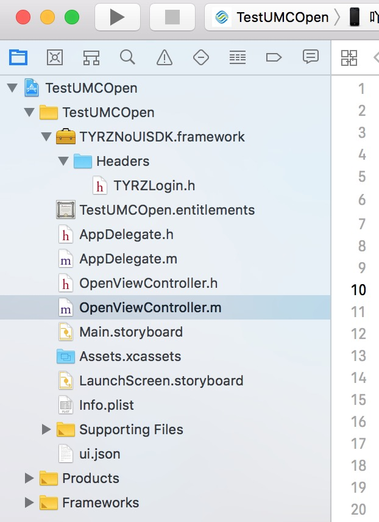
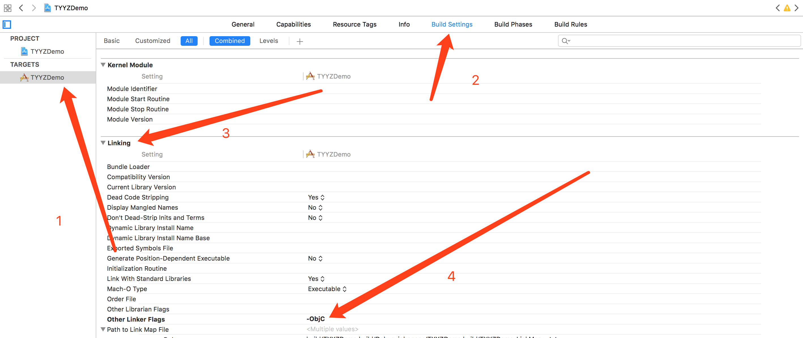
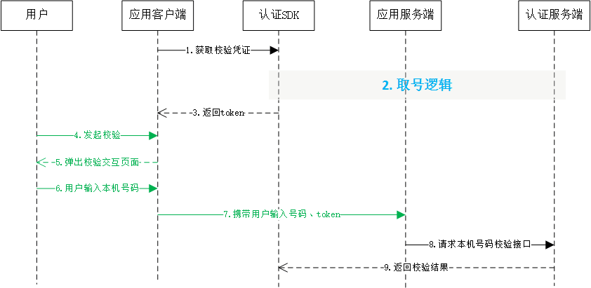

# 1. 开发环境配置 

sdk技术问题沟通QQ群：609994083

**注意事项：**

1. **认证取号服务必须打开蜂窝数据流量并且手机操作系统给予应用蜂窝数据权限才能使用**
2. **取号请求过程需要消耗用户少量数据流量（国外漫游时可能会产生额外的费用）**
3. **认证取号服务目前仅支持中国移动2/3/4G**

## 1.1. 准备工作

在中国移动开发者社区进行以下操作：

1. 获得appid和appkey；
2. 勾选本机号码校验能力；
3. 配置应用服务器的出口ip地址
4. 配置公钥（如果使用RSA加密方式）
5. 勾选本机号码校验短验辅助开关（可选）
6. 商务对接签约（未签约应用每个appid每天只能调用1000次）

## 1.2. 环境配置及发布

1. 导入统一认证framework

直接将统一认证`TYRZNoUISDK.framework`拖到项目中



2. 在Xcode中找到`TARGETS-->Build Setting-->Linking-->Other Linker Flags`在这选项中需要添加`-ObjC`



## 1.3. Hello 统一认证 

本节内容主要面向新接入统一认证的开发者，介绍快速集成统一认证的基本服务的方法。

### 1.3.1. 统一认证本机号码校验流程



由流程图可知，业务客户端集成SDK后只需要完成2步集成实现校验

1. 调用SDK方法来获得token；
2. 携带token通过业务服务端到认证服务端的本机号码校验接口，进行号码校验

### 1.3.2. 统一认证登录集成步骤

**第一步：**

初始化代码只需要执行一次就可以。

```objective-c
self.login = [TYRZLogin loginWithAppId:APPID appKey:APPKEY];
```

**第二步：**

在需要用到登录的地方调用登录接口即可，以下是登录示例

```objective-c
- (void)showImplicitLogin {
    [self.login requestTokenWithTimeout:8000 Complete:^(NSDictionary * _Nonnull    loginResponse) {

        weakself.maskView.hidden = YES;
        [weakself.indicatorView stopAnimating];

        NSString *resultCode = loginResponse[@"resultCode"];
        weakself.token = loginResponse[@"token"];
        NSMutableDictionary *result = [NSMutableDictionary dictionaryWithDictionary:loginResponse];
        if ([resultCode isEqualToString:CLIENTSUCCESSCODECLIENT]) {
            result[@"result"] = @"获取token成功";
        } else {
            result[@"result"] = @"获取token失败";
        }
        [weakself showInfo:result];
    }];
}
```

<div STYLE="page-break-after: always;"></div>

# 2. SDK方法说明
## 2.1. 获取校验凭证

### 2.1.1. 方法描述

请求校验凭证`token`，凭token调用本机号码校验接口。接口文档详见《平台接口文档》</br>

</br>

**原型**

`TYRZLogin -> requestTokenWithTimeout`

```objective-c
- (void)requestTokenWithTimeout:(NSTimeInterval)duration Complete:(void(^)(NSDictionary *))complete;
```

### 2.1.2. 参数说明

**请求参数**

| 参数       | 类型            | 是否必填 | 说明              |
| -------- | ------------- | ---- | --------------- |
| duration    | NSTimeInterval     | 是    | 请求时间  |
| complete | UAFinishBlock | 是    | 登录回调            |

**响应参数**


| 参数          | 类型         | 说明                                       |
| ----------- | ---------- | ---------------------------------------- |
| resultCode  | NSUinteger | 返回码       |
| token       | NSString   | 成功时返回：临时凭证，token有效期2min，一次有效，同一用户（手机号）10分钟内获取token且未使用的数量不超过30个 |
| resultDesc        | NSString   | 返回码描述                                |


### 2.1.3. 示例

**请求示例代码**


```objective-c
/**
 获取token
 */
 - (IBAction)loginimplicit:(id)sender {
 
    self.maskView.hidden = NO;
    [self.indicatorView startAnimating];
    typeof(self) weakself = self;
 
    [self.login requestTokenWithTimeout:8000 Complete:^(NSDictionary * _Nonnull loginResponse) {
 
        weakself.maskView.hidden = YES;
        [weakself.indicatorView stopAnimating];
 
        NSString *resultCode = loginResponse[@"resultCode"];
        weakself.token = loginResponse[@"token"];
        NSMutableDictionary *result = [NSMutableDictionary dictionaryWithDictionary:loginResponse];
        if ([resultCode isEqualToString:CLIENTSUCCESSCODECLIENT]) {
            result[@"result"] = @"获取token成功";
        } else {
            result[@"result"] = @"获取token失败";
        }
        [weakself showInfo:result];
 }];
 
 }
```


**响应示例代码**

```
{
    resultDesc = "";
    resultCode = 103000;
    token = STsid00000015087457254472qa7Mh1AAZH1U0xwvoMnKu5XxipjWXWE;
}
```

<div STYLE="page-break-after: always;"></div>

# 3. SDK返回码说明

| 返回码 | 返回码描述                       |
| ------ | -------------------------------- |
| 103000 | 成功                             |
| 200009 | Bundle ID校验失败                |
| 200011 | 不允许http请求                   |
| 200021 | 数据解析异常                     |
| 200022 | 无网络                           |
| 200023 | 请求超时                         |
| 200026 | 参数错误                         |
| 200027 | 蜂窝网络未开启或者蜂窝网络不稳定 |
| 200028 | 请求出错                         |
| 200029 | 请求出错,上次请求未完成          |
| 200030 | 没有初始化参数                   |
| 200047 | 网络异常                         |
| 200048 | 无SIM卡                          |
| 200050 | EOF异常，网络请求无数据流返回    |
| 200062 | 不支持联通号码                   |
| 200063 | 不支持电信号码                   |

<div STYLE="page-break-after: always;"></div>
